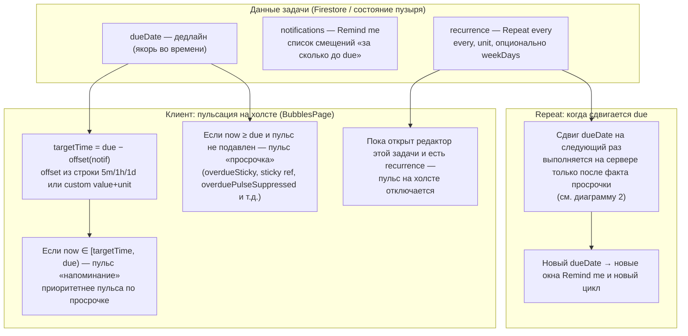
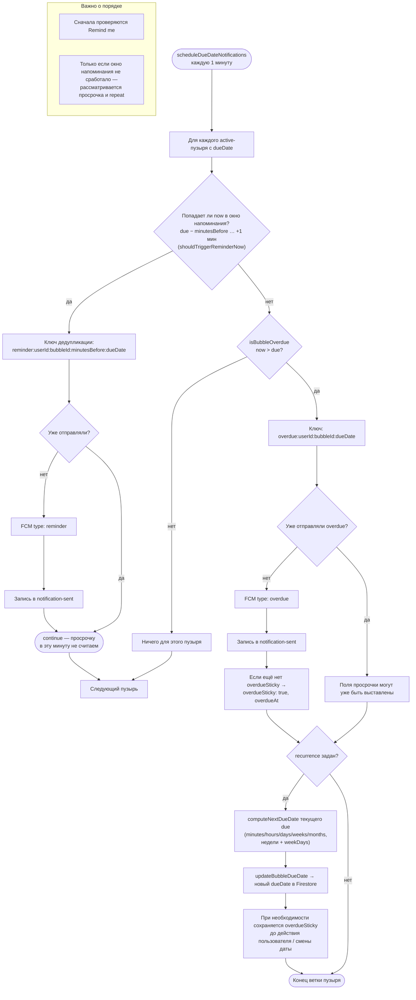

# Due date, Remind me, Repeat every — диаграммы (Mermaid)

Текстовое описание полей, поведения клиента и Cloud Function: **[BUBBLE_SCHEDULING.md](./BUBBLE_SCHEDULING.md)**.

Ниже — только схемы. Как поля задачи связаны между собой и как их обрабатывают клиент (`BubblesPage.js`) и облачный планировщик (`functions/index.js`: `scheduleDueDateNotifications`).

## 1. Модель данных и ось времени

## 2. Планировщик раз в минуту (FCM + просрочка + repeat)

