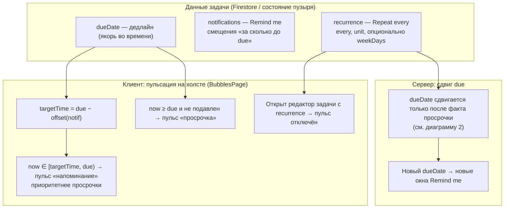

# Уведомления, дедлайны и повторы

Как устроены **дедлайн** (`dueDate`), **напоминания** («Remind me») и **повтор**
(«Repeat every»): где хранятся данные, как ведёт себя клиент (пульсация на холсте) и
как работает серверный планировщик FCM. Весь серверный код — в `functions/index.js`.

Про то, *почему* так спроектировано, см.
[спецификацию](superpowers/specs/2026-06-08-schedule-cost-optimization-design.md) и
[план](superpowers/plans/2026-06-08-schedule-cost-optimization.md).

## Содержание

- [Что делает система](#что-делает-система)
- [Где живёт код](#где-живёт-код)
- [Модель данных](#модель-данных)
- [Клиент: пульсация на холсте](#клиент-пульсация-на-холсте)
- [Сервер: ключевая идея `nextNotifyAt`](#сервер-ключевая-идея-nextnotifyat)
- [Серверные компоненты](#серверные-компоненты)
- [Тайминг расписания: `every N` vs `*/N`](#тайминг-расписания-every-n-vs-n)
- [Жизненный цикл задачи](#жизненный-цикл-задачи)
- [Диаграммы](#диаграммы)
- [Эксплуатация](#эксплуатация)
- [Подводные камни](#подводные-камни)
- [Чеклист для разработчика](#чеклист-для-разработчика)
- [Ключевые файлы](#ключевые-файлы)

## Что делает система

Отправляет пользователям FCM-уведомления по задачам (bubbles):

- **reminder** — заранее, за `minutesBefore` до срока (`dueDate`), для каждого элемента `notifications`;
- **overdue** — когда срок прошёл; для повторяющихся задач (`recurrence`) срок
  автоматически переносится на следующее вхождение.

## Где живёт код

| Область | Файл |
|---|---|
| Холст, пульсация, сохранение пузыря | `src/pages/BubblesPage.js` |
| Сохранение в Firestore, сброс полей при «выполнено» | `src/services/firestoreService.js` |
| Напоминания, просрочка FCM, перенос `dueDate`, `nextNotifyAt` | `functions/index.js` |

## Модель данных

Поля документа задачи, относящиеся к срокам:

- **`dueDate`** — локальная строка `YYYY-MM-DDTHH:mm:ss` (без смещения) + **`tz`** (IANA-зона).
  В абсолютный момент переводится через `parseLocalDateTime` (tz-aware, `TZDate`).
- **`notifications`** — массив напоминаний «за сколько до дедлайна». Элемент может быть:
  пресет-строкой (`5m`, `1h`, `1d`, `1w`), числом (минуты), объектом `{ minutesBefore }`
  или `{ value, unit }` (`minutes` / `hours` / `days` / `weeks`). Разбор на сервере
  централизован в `computeMinutesBefore`.
- **`recurrence`** — повтор, объект `{ every, unit [, weekDays] }`. `unit`: `minutes`,
  `hours`, `days`, `weeks`, `months`. Для недель с конкретными днями — массив `weekDays`
  (0 = воскресенье … 6 = суббота), см. `computeNextWeeklyDueDate`.
- **`overdueSticky`**, **`overdueAt`** — выставляются сервером при фиксации просрочки
  («липкая» просрочка и пульс между устройствами).
- **`overduePulseSuppressed`** — пользователь отключил пульс по сроку (кнопка Stop);
  хранится, чтобы пульс не возвращался после перезагрузки без нового дедлайна.
- **`nextNotifyAt`** — Firestore `Timestamp` (UTC), момент ближайшего необработанного
  события (см. [ниже](#сервер-ключевая-идея-nextnotifyat)).

При статусе **выполнено** (`BUBBLE_STATUS.DONE`) в `updateBubbleStatus` очищаются
`dueDate`, `notifications`, `recurrence` и флаги просрочки/подавления пульса.

## Клиент: пульсация на холсте

Пульсация — отдельная клиентская анимация, она **не зависит** от доставки push.
Для каждого активного пузыря с `dueDate` в цикле анимации:

1. Для каждого элемента `notifications` считается смещение до дедлайна (`getOffsetMs`).
2. Время срабатывания: `targetTime = due − offset`.
3. Если `now ∈ [targetTime, due)` — пульс **напоминания**. Он **приоритетнее** пульса
   просрочки: пока идёт окно напоминания, просрочный пульс для той же секунды не показывается.
4. При `now ≥ due` и отсутствии подавления — пульс **просрочки** (см. `shouldPulseOverdue`:
   учитываются `overdueSticky`, ручная остановка и `overduePulseSuppressed`).

Кнопка **Stop** снимает пульс и сохраняет `overduePulseSuppressed: true` вместе с
`overdueSticky: false` и `overdueAt: null`, чтобы состояние пережило перезагрузку. Любая
смена `dueDate` сбрасывает подавление. Пока открыт диалог редактирования задачи с
`recurrence`, пульс для неё отключается (чтобы не отвлекать при настройке).

## Сервер: ключевая идея `nextNotifyAt`

Раньше scheduled-функция каждую минуту читала **все** активные задачи всех пользователей —
дорого по Firestore reads и растёт линейно с базой. Теперь каждый документ задачи хранит
поле `nextNotifyAt` — момент **ближайшего необработанного события** (минимум из
reminder-времён и самого `dueDate`), и функция запрашивает только то, чему уже пора:

```js
db.collectionGroup('bubbles')
  .where('status', '==', 'active')
  .where('nextNotifyAt', '<=', Timestamp.fromDate(now))
  .orderBy('nextNotifyAt')
```

Стоимость теперь зависит от числа реально срабатывающих уведомлений, а не от размера базы.
Если будущих событий нет, поле удаляется (`FieldValue.delete()`) и задача выпадает из
запроса (range-фильтр `<=` не возвращает документы без поля).

## Серверные компоненты

### `nextNotifyAt` и его поддержка

Поле держат в актуальном состоянии три источника:

- **триггер `maintainNextNotifyAt`** — при создании/правке задачи пользователем;
- **scheduled-функция** — сдвигает поле вперёд после обработки события (в `finally`);
- **backfill-скрипт** — разово проставляет поле существующим задачам (см. [Эксплуатация](#эксплуатация)).

### `computeNextNotifyAt(bubble, fromTime)`

Чистая функция (экспортируется в `exports._test`, покрыта `functions/test-next-notify.js`):

- собирает «триггерные моменты»: для каждого `notif` → `dueDate − minutesBefore`; плюс `dueDate` (overdue);
- возвращает **минимальный момент строго позже `fromTime`**;
- если будущих нет — возвращает `fromTime` (немедленная обработка), когда задача просрочена
  и overdue ещё не слался (`!overdueSticky`) **или** есть `recurrence`, и при этом не `overduePulseSuppressed`;
- иначе `null`. Результат всегда в UTC.

### Триггер `maintainNextNotifyAt`

`onDocumentWritten` на `user-bubbles/{uid}/bubbles/{bubbleId}`, регион `europe-west1`,
`maxInstances: 10`.

- На удаление документа — выходит.
- **Гард от рекурсии:** `significantChanged(before, after)` сравнивает только
  `['dueDate', 'notifications', 'status', 'recurrence']`. Запись самого `nextNotifyAt`
  не считается значимой → нет бесконечного цикла.
- Иначе пишет `computeNextNotifyAt(after, now)` (или удаляет поле).

### Scheduled-функция `scheduleDueDateNotifications`

`onSchedule` `every 1 minutes`, регион `europe-west1`, `maxInstances: 10`. Каждый прогон:

1. на минуте `:00` каждого часа — `cleanupOldNotificationSent()` (чистит записи старше 7 дней);
2. `fetchDueBubbles(now)` — индексный запрос только due-задач, группировка по пользователю;
3. FCM-токены читаются **только** для пользователей из выборки (`getUserFcmTokens`);
4. для каждой задачи: `isBubbleOverdue` → `handleOverdue`, иначе `handleReminder`;
5. в `finally` — **всегда** `updateNextNotifyAt(...)`, иначе задача читалась бы каждую минуту.

- **`handleReminder`** — выбирает свежий наступивший reminder (`pickReminderToSend`,
  без жёсткого окна — пропуск минуты не теряет напоминание), шлёт, дедуп по `notification-sent`.
- **`handleOverdue`** — шлёт overdue (дедуп), ставит `overdueSticky`; для `recurrence`
  переносит `dueDate` на ближайшее будущее (`computeNextFutureDueDate`); обновляет поля
  задачи **и локальную копию** `bubble`, чтобы финальный `updateNextNotifyAt` считал от
  свежего состояния.

### Дедупликация

Коллекция `notification-sent` (доступна только admin SDK). Ключи:
`reminder:{uid}:{bubbleId}:{minutesBefore}:{dueDate}` и `overdue:{uid}:{bubbleId}:{dueDate}`.
Строка `dueDate` входит в ключ — при новом дедлайне уведомление можно отправить снова.
Записи старше 7 дней чистятся ежечасно.

### Composite index

`firestore.indexes.json`: collection group `bubbles`, поля `status ASC, nextNotifyAt ASC`
(`COLLECTION_GROUP`). Порядок обязателен: equality (`status`) перед range/order (`nextNotifyAt`).

## Тайминг расписания: `every N` vs `*/N`

`onSchedule` принимает **оба** формата, но ведут они себя по-разному. Сейчас стоит
`every 1 minutes`; при переходе на более редкий запуск это важно.

- **`every N minutes`** (App Engine) — «end-time interval»: отсчёт от момента деплоя и от
  конца предыдущего запуска, время «плавающее» и **не кратное** N (`13:03 → 13:08 → 13:13…`).
- **`*/N * * * *`** (unix-cron, Cloud Scheduler) — привязка к началу часа, срабатывает
  **строго кратно** N (`13:00 → 13:05 → 13:10…`) независимо от времени деплоя.

Почему это критично: cleanup завязан на конкретную минуту часа:

```js
// functions/index.js — внутри scheduleDueDateNotifications
if (now.getMinutes() === 0) {
    await cleanupOldNotificationSent();
}
```

С `*/N` минута `:00` гарантированно попадает раз в час → cleanup работает. С `every N`
расписание может встать на `:03, :08…` — `getMinutes() === 0` **не сработает никогда**, и
`notification-sent` будет расти бесконечно.

> **Вывод:** при переходе на запуск реже минуты используйте `*/N * * * *`, а не `every N minutes`.

Источники: [Cloud Scheduler — cron format](https://cloud.google.com/scheduler/docs/configuring/cron-job-schedules),
[App Engine — cron.yaml](https://cloud.google.com/appengine/docs/legacy/standard/python/config/cronref).

## Жизненный цикл задачи

`dueDate = 15:00`, напоминания за 60 и 10 минут, без `recurrence`:

| Прогон | Действие | Новый `nextNotifyAt` |
|---|---|---|
| 14:00 | reminder «за 60» | 14:50 |
| 14:50 | reminder «за 10» | 15:00 |
| 15:00 | overdue | поле удалено |

С `recurrence`: на шаге overdue `dueDate` переносится на следующий цикл → `nextNotifyAt`
указывает на reminder/overdue нового вхождения.

## Диаграммы

### 1. Модель данных и клиентская пульсация



### 2. Триггер и планировщик (модель `nextNotifyAt`)

```mermaid
flowchart TD
  subgraph trig["Триггер maintainNextNotifyAt (onDocumentWritten)"]
    w["Запись задачи пользователем"] --> sig{"significantChanged?<br/>dueDate / notifications / status / recurrence"}
    sig -->|нет| skipT["Выйти — это запись самого nextNotifyAt"]
    sig -->|да| comp["computeNextNotifyAt(after, now)"]
    comp --> setN["Записать nextNotifyAt<br/>(или FieldValue.delete, если событий нет)"]
  end

  subgraph sched["scheduleDueDateNotifications (every 1 minute)"]
    s0(["Старт прогона, now"]) --> clean{"now.getMinutes() == 0?"}
    clean -->|да| cl["cleanupOldNotificationSent (>7 дней)"]
    clean -->|нет| q["fetchDueBubbles:<br/>status==active AND nextNotifyAt <= now"]
    cl --> q
    q --> grp["Группировка по пользователю +<br/>FCM-токены только для них"]
    grp --> each["Для каждой due-задачи"]
    each --> ov{"isBubbleOverdue?"}
    ov -->|да| ho["handleOverdue: FCM overdue (дедуп), overdueSticky;<br/>recurrence → computeNextFutureDueDate → новый dueDate"]
    ov -->|нет| hr["handleReminder: pickReminderToSend → FCM reminder (дедуп)"]
    ho --> fin["finally: updateNextNotifyAt (всегда)"]
    hr --> fin
  end
```



## Эксплуатация

Cloud Functions и индексы деплоятся **вручную** (`firebase deploy`), отдельно от фронтенда
(фронт — CI на GitHub Pages, см. [deployment.md](deployment.md)).

### Деплой (порядок критичен)

1. `firebase deploy --only firestore:indexes` — дождаться статуса **Enabled**
   (Console → Firestore → Indexes).
2. `firebase deploy --only functions:maintainNextNotifyAt` — первый Gen2-деплой может
   упасть на «Permission denied … Eventarc Service Agent»; это пропагация прав, повторить через ~5 минут.
3. **Backfill** (см. ниже) — проставить `nextNotifyAt` существующим задачам.
4. `firebase deploy --only functions:scheduleDueDateNotifications`.

> ⚠️ Нельзя деплоить scheduled-функцию (шаг 4) раньше backfill (шаг 3): задачи без поля
> выпадут из запроса, и уведомления замолчат, пока поле не появится.

### Backfill

Скрипт разовый и удалён из репозитория после первого прогона (есть в git-истории, коммит
`2082a66`). Нужен при первичном вводе поля или массовой рассинхронизации:

```js
const admin = require('firebase-admin');
const { Timestamp, FieldValue } = require('firebase-admin/firestore');
const { _test } = require('./index.js'); // инициализирует admin app; reuse computeNextNotifyAt
const { computeNextNotifyAt } = _test;
const db = admin.firestore();
(async () => {
    const now = new Date();
    const snap = await db.collectionGroup('bubbles').where('status', '==', 'active').get();
    for (const d of snap.docs) {
        const bubble = Object.assign({ id: d.id }, d.data() || {});
        const next = computeNextNotifyAt(bubble, now);
        await d.ref.set({ nextNotifyAt: next ? Timestamp.fromDate(next) : FieldValue.delete() }, { merge: true });
    }
    process.exit(0);
})();
```

Запуск (нужны Application Default Credentials, например ключ сервис-аккаунта; **без**
`FIRESTORE_EMULATOR_HOST`, иначе запишет в эмулятор):

```bash
GOOGLE_APPLICATION_CREDENTIALS=/path/to/sa-key.json TZ=UTC \
  GOOGLE_CLOUD_PROJECT=todo-flutter-fb8bf node functions/backfill-next-notify.js
```

Ключ сервис-аккаунта — секрет: хранить вне репозитория, удалить после.

### Диагностика

`firebase functions:log --only scheduleDueDateNotifications` — чистые прогоны почти пустые
(функция логирует только ошибки через `console.error`).

- **Уведомления молчат** → у активных задач есть `nextNotifyAt`? индекс **Enabled**?
  триггер `maintainNextNotifyAt` задеплоен? (без него новые задачи поле не получат).
- **`FAILED_PRECONDITION ... requires an index`** → индекс ещё строится или не задеплоен.
- **Просроченные за время «дыры»** не теряются: их `nextNotifyAt <= now`, попадут в выборку
  и отправятся с задержкой (дедуп не задвоит).

### Локальный эмулятор

```bash
firebase emulators:start --only functions,firestore
```

Нужна Java для Firestore-эмулятора.

- Триггер `maintainNextNotifyAt` работает — можно проверять проставление/пересчёт поля.
- Scheduled-функция по расписанию **не запускается** без pubsub-эмулятора (`onSchedule`
  требует Cloud Scheduler/Pub-Sub); для полного прогона нужен pubsub-эмулятор + ручной триггер.

## Подводные камни

- **`Timestamp`/`FieldValue` импортируются модульно:**
  `const { Timestamp, FieldValue } = require('firebase-admin/firestore')`. Через
  `admin.firestore.Timestamp` в Functions-эмуляторе получается `undefined` (эмулятор
  патчит `firebase-admin`). Модульный импорт работает и в эмуляторе, и в проде.
- **Часть существующего кода** (`updateBubbleDueDate` / `updateBubbleFields` /
  `markNotificationSent`) ещё использует `admin.firestore.FieldValue.serverTimestamp()` —
  в проде работает, но в эмуляторе упадёт; при тестировании в эмуляторе эти места тоже надо
  перевести на модульный импорт.
- **Расписание `every 1 minutes`** (App Engine-синтаксис) — при переходе на «реже минуты»
  см. [Тайминг расписания](#тайминг-расписания-every-n-vs-n).
- **Legacy-схема мертва:** все задачи в субколлекции `user-bubbles/{uid}/bubbles/{bubbleId}`;
  индексные запросы по полям внутри старого массива `bubbles[]` невозможны, и серверная
  логика на него не рассчитывает.

## Чеклист для разработчика

1. Меняете формат `notifications` — синхронизируйте `getOffsetMs` (клиент) и
   `computeMinutesBefore` (functions).
2. Меняете правила `recurrence` — обновите `computeNextDueDate` / `computeNextWeeklyDueDate`
   и тесты (перенос через полночь, DST).
3. Добавляете поле документа задачи — не забудьте `saveBubblesToFirestore` и маппинг при
   загрузке (`BubblesPage.js` / `firestoreService.js`). Если поле влияет на сроки/напоминания,
   учтите его в `computeNextNotifyAt` и в списке `significantChanged`.

## Ключевые файлы

- `functions/index.js` — вся серверная логика (триггер, scheduled-функция, чистые функции).
- `functions/test-next-notify.js` — unit-тесты (`computeNextNotifyAt`, `pickReminderToSend`, `significantChanged`).
- `firestore.indexes.json` — composite index.
- `src/pages/BubblesPage.js` — клиентская пульсация и сохранение пузыря.
- `src/services/firestoreService.js` — сохранение и сброс полей при «выполнено».
